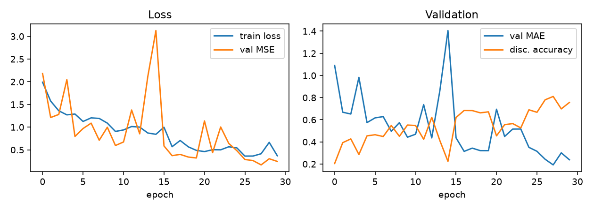
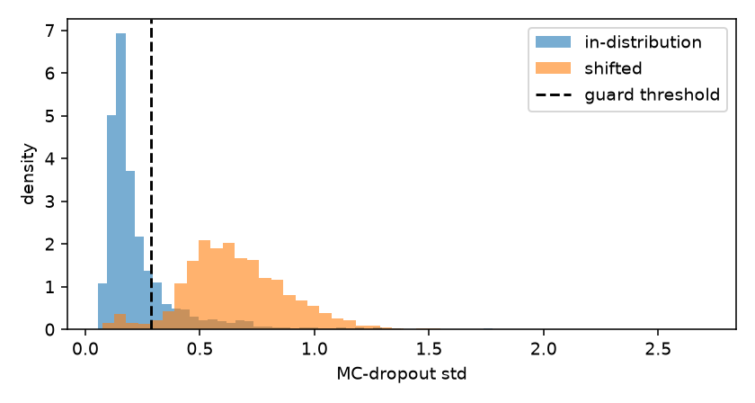
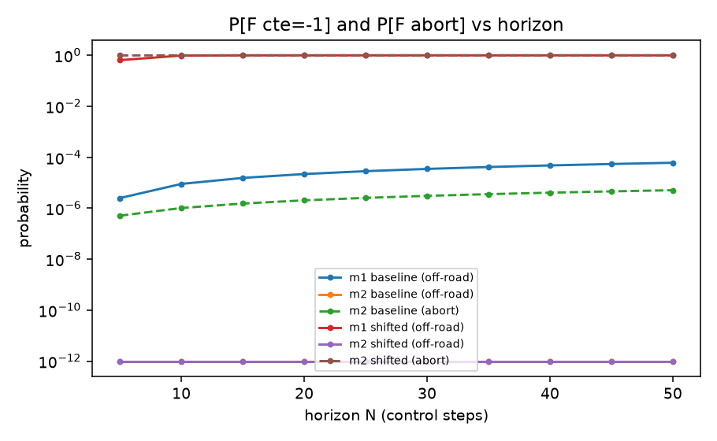

# Closed-loop safety analysis of a vision-based lane-keeping system

Auto-generated results report. Figures in `results_cte/figures/`.

## 1. Perception model (in-distribution)

- Best val MAE: **0.1925** (TaxiNet reference: 1.185 on a ±8 m range)
- Final discretized state accuracy: **75.6%**

## 2. Perception abstraction α (in-distribution)

- On-road discretized accuracy: **81.17%** (1912 held-out samples)

| true \ est | far-L | near-L | LANE | near-R | far-R | n |
|---|---|---|---|---|---|---|
| far-L | 0.660 | 0.325 | 0.010 | 0.005 | 0.000 | 200 |
| near-L | 0.041 | 0.767 | 0.189 | 0.000 | 0.002 | 434 |
| LANE | 0.000 | 0.042 | 0.851 | 0.107 | 0.000 | 740 |
| near-R | 0.000 | 0.000 | 0.079 | 0.889 | 0.032 | 442 |
| far-R | 0.000 | 0.000 | 0.000 | 0.333 | 0.667 | 96 |

## 3. MC-Dropout run-time guard (in-distribution calibration)

- Threshold: std ≤ **0.2849** (80.0th pct of val stds), β = **0.800** (paper: 0.821), M = 10
- Accuracy all inputs 81.33% → passing inputs 81.80%

Guarded α (passing inputs only):

| true \ est | far-L | near-L | LANE | near-R | far-R | n |
|---|---|---|---|---|---|---|
| far-L | 0.612 | 0.365 | 0.024 | 0.000 | 0.000 | 85 |
| near-L | 0.045 | 0.829 | 0.123 | 0.000 | 0.003 | 381 |
| LANE | 0.000 | 0.079 | 0.827 | 0.094 | 0.000 | 735 |
| near-R | 0.000 | 0.000 | 0.102 | 0.859 | 0.039 | 441 |
| far-R | 0.000 | 0.000 | 0.000 | 0.315 | 0.685 | 89 |

## 4. Uncertainty under shift

- MC std median: ID 0.171 → shifted 0.635

## 5. Distribution shift

- Shifted on-road accuracy: **5.15%** (vs ~81% ID); shifted MAE **3.28** (vs 0.19 ID); β under ID threshold: **0.041**

Shifted α:

| true \ est | far-L | near-L | LANE | near-R | far-R | n |
|---|---|---|---|---|---|---|
| far-L | 0.867 | 0.024 | 0.012 | 0.000 | 0.096 | 83 |
| near-L | 0.938 | 0.035 | 0.017 | 0.002 | 0.008 | 836 |
| LANE | 0.893 | 0.056 | 0.043 | 0.008 | 0.001 | 1951 |
| near-R | 0.948 | 0.014 | 0.018 | 0.020 | 0.001 | 1419 |
| far-R | 0.622 | 0.012 | 0.061 | 0.146 | 0.159 | 82 |

- Pixel-level JS divergence: **0.180** bits (low: the tracks look similar)
- Feature-space Mahalanobis: median 1.98 → 4.26; **AUROC 0.875** as OOD detector
- Feature-space symmetrized KL: **10.4 nats**
- corr(Mahalanobis, MC std): ID 0.80, shifted 0.49

## 6. Formal safety (PRISM)

| curve | value at N=30 |
|---|---|
| m1 baseline (off-road) | 3.51e-05 |
| m2 baseline (off-road) | 0 |
| m2 baseline (abort) | 3.07e-06 |
| m1 shifted (off-road) | 1 |
| m2 shifted (off-road) | 0 |
| m2 shifted (abort) | 1 |

Note: probabilities of exactly 0 are zero-observation point estimates (no such misperception among the passing samples), bounded by sample size rather than proven — the paper's Appendix-E caveat.

### 6b. Bootstrap confidence intervals

PRISM computes an exact answer for the alpha it is given, but alpha is estimated from finite counts (the far-L row rests on ~200 samples, far-R on ~96, and a single misperception carries most of the off-road risk). Each row was resampled from a Dirichlet posterior with Jeffreys' prior and re-checked in PRISM; percentiles give the intervals below. Zero-count cells receive small positive mass rather than being asserted impossible.

| model | N | point | median | 90% CI | 95% CI |
|---|---|---|---|---|---|
| m1_N30 | 30 | 3.51e-05 | 0.000112 | [2.15e-05, 0.000512] | [1.37e-05, 0.000631] |
| m1_shift_N30 | 30 | 0.999999 | 0.999998 | [0.999986, 1.000000] | [0.999974, 1.000000] |
| m2_N30 | 30 | 0 | 0.000123 | [1.52e-05, 0.000695] | [1.23e-05, 0.000821] |

Bootstrap medians sit above the plug-in point estimates because the map from alpha to the reaching probability is convex in the small critical cells (Jensen), and Jeffreys' prior adds half a count to rare cells - expected, not an error.

**Interpretation.** In-distribution, the m1 and m2 intervals overlap almost entirely: with ~2,000 validation samples the guard's effect on off-road probability is *not resolvable*, and the point-estimate contrast (3.5e-5 vs 0) was within sampling noise. Under shift the unguarded estimate is both extreme and tight, because that alpha rests on thousands of samples with large probabilities. The supported claim is therefore: in-distribution the guard is neither needed nor harmful; under shift the unguarded system fails with probability ~1 while the guarded system hands over.

**Why bootstrap rather than FACT.** The reference study obtains formal (1-delta) intervals with FACT via parametric model checking over the raw counts. The authors report it scaling poorly - no results beyond N=4 within a two-hour timeout, with zero-observation transitions dropped to make it tractable. The bootstrap reuses the existing PRISM toolchain, has no horizon ceiling, and handles zero cells naturally, at the cost of being empirical rather than formally guaranteed. FACT remains the more rigorous option for authors who want it.

## 7. Live closed-loop runs

| run | frames | handovers | hand-backs | MODEL: n / cert% / mean\|cte\| / off-road% | FALLBACK: n / mean\|cte\| / off-road% |
|---|---|---|---|---|---|
| generated-roads | 3702 | 1 | 0 | 9 / 0% / 0.00 / 0.0% | 3693 / 0.72 / 0.1% |
| generated-track | 1650 | 4 | 4 | 1269 / 92% / 0.64 / 3.5% | 381 / 1.27 / 19.9% |

## 8. Limitations and further work

- Zero-observation transitions: measured 0-probabilities are point estimates bounded by sample size; section 6b attaches bootstrap intervals, and FACT remains the formal alternative.
- Interval asymmetry: the *safe* in-distribution estimates carry wide intervals (thin far-L/far-R rows) while the *unsafe* shifted estimate is precise. Reassuring safety claims need more data - specifically more samples in the extreme lane states, not more data overall.
- Deterministic dynamics in the DTMC isolate perception-induced risk; environmental drift (curves) is unmodeled.
- Procedurally generated tracks regenerate per load unless useSeed is set; live cross-session comparisons on generated tracks require a fixed seed. Dataset-level results are unaffected.
- Augmentation ablation under shift: training already used flip + brightness jitter and still failed on the shifted instance; a heavier recipe (rotation, shadows, stronger photometric jitter) should narrow — but cannot close — the gap. Measure how much, and how the guard fire-rate responds.
- Static extreme-shift dose (mini_monaco), transient shift via randomLight (the live hand-back demonstration), and resumption-safety modeling for the bidirectional guard.
